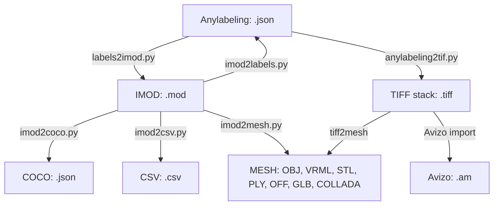

# Cell Segment Toolkit 

The cell segmentation toolkit is a collection of tools that enables 3D data conversion between different microsocopy frameworks and offers workflows for multiple AI segmentation tools. The toolkit is designed to be used with 3D cell frameworks such as IMOD, MONAI, 3DSclicer, and Avizo in conjunction with AI-assisted segmentation annotation tools such as Anylabeling and other open-source segmentation software.

## Installation

The toolkit is written in Python and can be installed using conda or mamba:

```bash
conda create -n cellsegment python=3.10
conda activate cellsegment
conda env update --file environment.yaml
```

To leverage conversions to/from IMOD, the toolkit requires the installation of the [IMOD software package](https://bio3d.colorado.edu/imod/).

## Overview

The following conversion tools are currently build as part of this project:



## Usage

### IMOD to COCO

Convert IMOD model (.mod) to a COCO json file with annotations for polygon segmentation.

```bash
python imod2coco.py -i IMOD_model.mod -p /path/to/image/files/ -f png
```

### IMOD to CSV

Helper tool to read IMOD model to pandas dataframe and saving to csv file.

```python
import imod2csv
infname = 'IMOD_model.mod'
df = imod2csv.load_model(infname, outfname_csv)
```

### IMOD to Anylabeling json

Convert IMOD model (.mod) to a json file with labels for Anylabeling.

```bash
python imod2labels.py -i IMOD_model.mod -p /path/to/image/files/ -f png
```

### Anylabeling json to IMOD

Converts polygon label files in Anylabeling json format to IMOD model files (.mod).

```Python
import labels2imod
inpath = '/path/to/json/files/'
labels2imod.convert(inpath, outfname_mod)
```

### Anylabeling json to TIFF

Converts Anylabeling json annotation files to multistack tiff images (e.g. for Avizo).

```bash
python anylabeling2tif.py --path_json /path/to/json/files --path_out /path/to/output/
```

### IMOD to Mesh

Converts IMOD model files (.mod) to mesh files in various formats (OBJ, VRML, STL, PLY, OFF, GLB, COLLADA).

```bash
python imod2mesh.py -i IMOD_model.mod -o OBJ
```

### TIFF image stack to mesh

Converts a tiff image stack to to mesh files in various formats (OBJ, VRML, STL, PLY, OFF, GLB, COLLADA).

```bash
python python tiff2mesh.py --directory path/to/images --filename_pattern {}.tif --filename_out FNAME_MESH_OUTPUT.wrl --file_format VRML --grid_spacing 1 1 1
```
