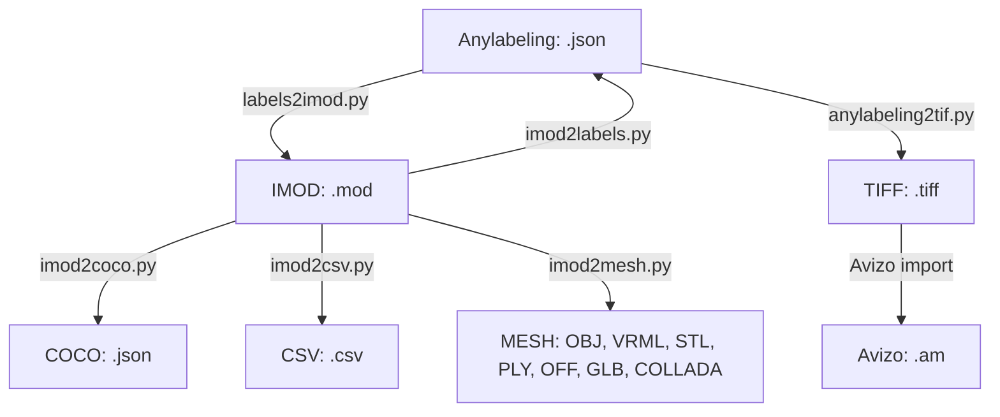

# Cell Segment Toolkit 

The cell segmentation toolkit is a collection of tools that can be used to convert data from one format to another. The toolkit is designed to be used in conjunction with 3D cell frameworks such as IMOD, MONAI, 3DSclicer, Avizo, and AI-assisted segmentation annotation tools such as Anylabeling and COCO format.

## Installation

The toolkit is written in Python and can be installed using pip:

```bash
conda create -n cellsegment python=3.10
conda activate cellsegment
conda env update --file environment.yaml
```

## Overview

The following conversion tools have been built as part of this project:


